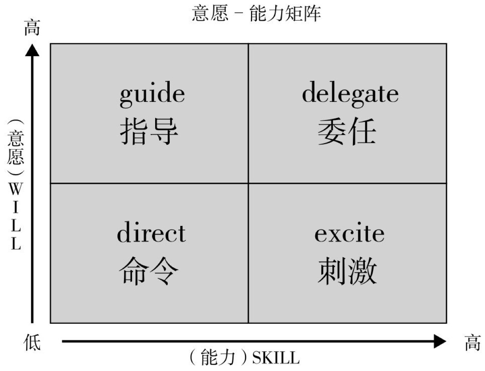
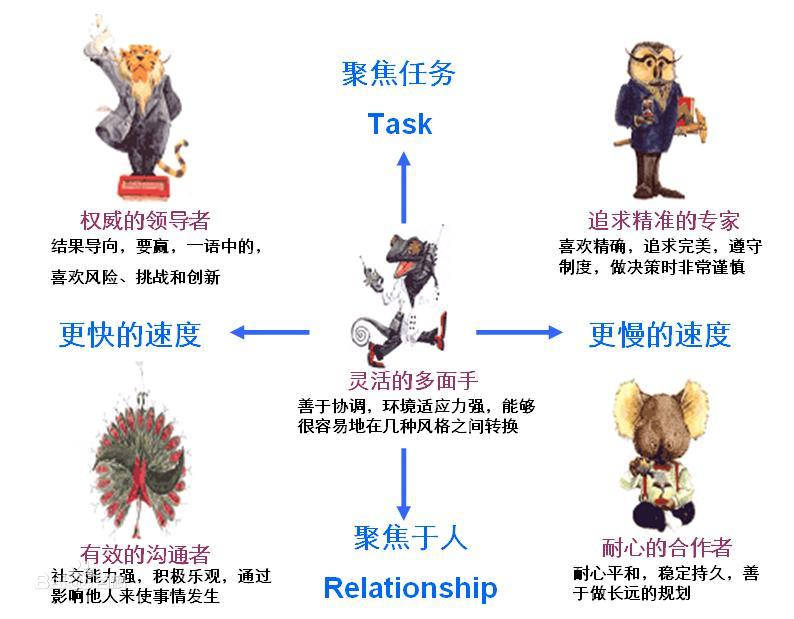

# 自己常用的

## 管理者的分类 -- 《哈佛商业评论》

### 1. 保姆型

### 2. 啦啦队长型

### 3. 老师型

### 4. 连接型

## 被管理者的分类方式

### 根据意愿-能力矩阵

### 根据 PDP 性格测试

1. 老虎(支配型): 结果导向，要赢，一语中的，喜欢风险、挑战和创新
2. 孔雀(外向型): 社交能力强，积极乐观，通过影响他人来使事情发生
3. 考拉(耐心型): 耐心平和，稳定持久，善于做长远的规划
4. 猫头鹰(精确型): 喜欢精确，追求完美，遵守制度，做决策时非常谨慎
5. 变色龙(整合型): 善于协调，环境适应力强，能够很容易地在几种风格之间转换

## 时间管理

### 重要-紧急矩阵

## 一分钟管理

### 1. 一分钟目标

1. 对目标的意见一致。
2. 知道什么是有效的行动。
3. 将你的每个目标用不超过 250 个字写在一张纸上。
4. 经常阅读每一个目标，而且每读一次只要一分钟左右。
5. 从你的工作日里拿出一分钟检查一下你的工作。
6. 看看你的行动是否与目标相符。

### 2. 一分钟称赞

1. 从一开始就告诉人们，让他们知道他们自己干的怎么样。
2. 及时称赞他们。
3. 明确地告诉他们什么事情做的对。
4. 告诉人们你对他们的工作感到很满意，他们的工作对企业和其他在这里工作的人们都有帮助。
5. 然后停下来，沉默一会，让他们“感到”你的心情多么愉快。
6. 鼓励他们多做这样的事。
7. 与他们握手或用某种方式与他们接触，使他们清楚地知道你支持他们在企业中取得成功。

### 3. 一分钟指责

1. 事先就告诉人们， 而且是用毫不合含糊的字眼告诉人们，你会使他们知道自己工作得怎样。

#### 指责的前半部分

1. 及时地给予指责。
2. 准确地告诉人们做错了什么。
3. 用毫不含糊的字眼告诉人们你此刻的心情。
4. 做几秒钟令人不舒服的沉默、让他们能感觉到你的心情。

#### 指责的后半部分

1. 同他们握手或用某种方式进行接触，使他们懂得你是诚挚地站在他们一边。
2. 让他们想起你是怎样地器重他们。
3. 再次表明你所不满的是他们工作的失误，而不是他们本人。
4. 指责完了，就是完了。

## 一对一沟通

- 频率: 1 个月左右
- 方式: 可以提前 1-2 天把准备沟通的问题发给对方

### 常沟通的问题

1. 你有没有认为自己的价值和能力被低估了呢？为什么？
2. 你觉得你在工作中能学到东西吗？最近学到了什么？你还希望在哪些领域进行学习？
3. 近期对自己有哪些满意和不满意的地方？
4. 目前的工作有哪些困惑，希望我如何去帮你？
5. 对团队和我有哪些建议和期许？
6. 在公司战略和目标方面，你最不清楚的是什么？

### 遇到问题谈心 5 问

1. 发生了什么事情？
2. 你怎么看？
3. 你都试了哪些方法？
4. 你需要哪些帮助？
5. 还有吗？

## 培训下属

1. 我说你听: 交代清楚是什么、为什么、怎么做
2. 你说我听: 让下属重复，确保他理解了要点
3. 我做你看: 亲身示范，不要嫌麻烦，不要跳步
4. 你做我看: 观察的时候不要打断，反馈的时候下属先说你再说
