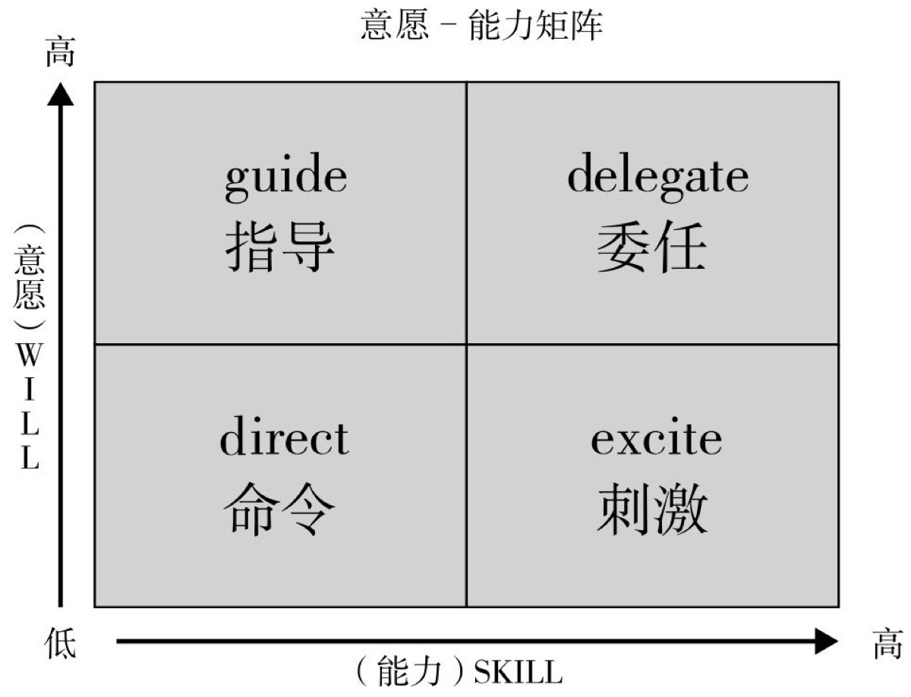

# 耐奇项目及技术管理

## 耐奇主页

## 系统设计

### 功能需求

- 面对一个复杂度高的系统，通常可以从两个方向做拆分
- 水平方式是基于业务来做拆分，就是模块化
- 垂直方向是基于流程来做拆分，就是分层
- 不管分层、模块化、还是 OOP、DDD、以及各种设计模式、设计原则和思想，都是为了应对系统的复杂性

### 非功能需求

#### 1. 易用性

- 配置采用图形化编辑，属性值支持边界检测，在界面中实时提醒

#### 2. 性能

- Electron 中默认的 remote 通信方式内部采用的实现方式是同步方式，优势是使用简单，很容易导致性能瓶颈
- 对象编辑后需要保存到文件中，利用防抖函数，减少耗性能的 IO 操作
- 列表页展示 10W+日志分析，使用 react-virtualized 库，只生成可视区域的 dom 节点
- 梳理 React 渲染机制，使用 shouldComponentUpdate，减少无意义的 render 调用
- 加速首屏渲染时间，采用动态 import 的方式，只加载当前需要展示的部分

#### 3. 扩展性

- 未来打算支持插件化的方式，动态扩展功能

#### 4. 容错性

- 支持撤销重做，解决误操作回滚

#### 5. 可测试性

- 每个模块都可以通过配置参数独立测试

#### 6. 安全性

- 内部软件，暂不考虑

### 难点

1. 内置 lua 编辑器，支持语法检测、U3d API 智能提示

## 代码质量控制

### 好代码标准

#### 1. 可维护性

- 熟练运用各种设计思想、设计模式，在不破坏原有代码设计、不引入新的 bug 的情况下，能够快速修改或者添加代码

#### 2. 可读性

- 组织代码 review，写出让别人容易理解的代码

#### 3. 可扩展性

- 日志分析模块，采用策略模式，每新增一种日志类型，无需修改原来的代码，对修改关闭，对扩展开放

#### 4. 简洁性

- 遵循 KISS 原则，思从深而行从简

#### 5. 可复用性

- 通过分层等方式，抽象出了很多底层可以复用的模块、类等代码，上层可以直接拿来使用

#### 6. 可测试性

- 核心代码有完整的单元测试，通过依赖注入减少类之间的耦合度，方便 mock
- 有效保证重构时的完整性和正确性

### 重构

#### 小重构

- 编码规范 80%由 eslint, prettier, code spell check 工具保证
- 重点考察命名，文件结构、抽象复用等问题

#### 大重构

- 重点考察是否满足设计原则、高内聚低耦合等设计思想
- 如：mobx 从 v4 升级到 v5，大大减少了原来代码的复杂度

## 技术管理

- 在特定环境下，管理者通过执行计划、组织、领导、控制等职能，整合组织的各项资源，实现组织既定目标的活动过程 -- 《管理学》斯蒂芬·罗宾斯

### 计划职能

- 设定中长期目标，划分里程碑

### 组织职能

- 按照`能力意愿模型`划分成员，根据不同的类型采用不同的指导方式

### 领导职能

- 根据四种不同的管理者类型，时时提醒自己要成为一个连接型的管理者
  - 保姆型：有难题就自己上，忙的只有管理者，成员也不会有成长
  - 啦啦队长型：不给下面的人提供任何支持，只在旁边加油打气
  - 老师型：管理者的能力上限就是成员的能力上限
  - 连接型：连接业界优秀的人员或者资源给成员，成员没有成长的天花板
- 组织小组内分享，打造学习型团队

### 控制职能

- 晨会、周会把控进度，识别风险
- 每个迭代后复盘，总结经验教训
