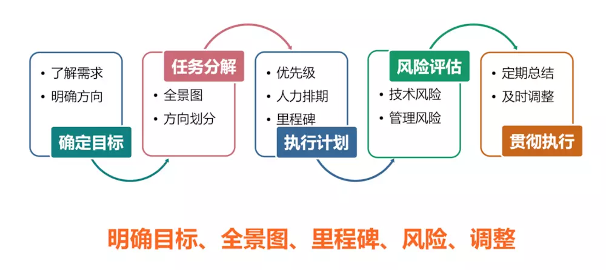

# 技术管理

## 团队不同阶段的管理风格

### 集权式管理 - 空降/团队创建初期

### 放权式管理 - 团队稳定期

## 规划

- 就是个人或组织制定的比较全面长远的发展计划，是对未来整体性、长期性、基本性问题的思考和考量，设计未来整套行动的方案。规划是融合多要素、多人士看法的某一特定领域的发展愿景。
- 规划的意义就在于给到一个长远的目标，起到了灯塔的作用，也许一开始并不能马上就找准方向得到理想的结果，但是通过设立规划目标、阶段性的里程碑，不断做有积累的事情，最终就能够得到理想的结果。

### 技术规划相对于日常技术优化的特点

- 整体性：技术规划一定是对现有系统有体系化的思考，得出一个全面整体的改进方案，不在停留在某些具体优化点之上
- 长期性：技术规划一般周期都在在季度、半年度甚至年度，这就意味着这件事情是比较长期稳定的，需要持续推进的
- 方向性：技术规划需要针对某个方向，提出一个较为长远的目标，设计全面的发展计划和行动方案

### 如何做技术规划

#### 1. 前期准备

- 业务分析：
- 业界对标：

#### 2. 设立目标

- 遵循 SMART 原则

#### 3. 任务分解

- 目标拆解，形成可执行的计划
- 全景图：
- 明确可执行：

#### 4. 执行计划

- 设定里程碑

#### 5. 风险评估

- 技术风险：前期需要评估技术可行性，结合团队技能和梯队情况，充分调研业界最佳实践，寻找到合适自己的技术方案，一定要记住不要被“颠覆性”的想法冲昏了头脑。
- 管理风险：团队人员配备是否充足，是否会因为业务波峰波谷导致技术需求无法持续，这个需要考验技术 leader 对于未来业务的判断，同时和业务团队充分沟通，针对技术需要留有一些固定比例人力，保证技术项目的长期性。

#### 6. 贯彻执行

- 总结复盘

## 参考

- [程序员如何做好技术规划](https://www.cnblogs.com/wdsunny/p/11244726.html)
